# 2. 펌웨어 추출

### **시작하는 글**

앞선 문서에서는 소형 임베디드 기기 펌웨어 분석과 동적 분석 환경 구축에 필요한 기본 개념을 살펴보았다. 이 문서에서는 해당 지식을 바탕으로 상용 IoT 기기인 **Jooan C9TS IP 카메라**를 대상으로 하드웨어 기반 펌웨어 추출 절차를 단계별로 적용한 과정을 설명한다.

임베디드 시스템은 범용 컴퓨터와 달리 제한된 자원으로 단일 목적을 안정적으로 수행하도록 설계된다. 이들 기기의 핵심 소프트웨어인 펌웨어는 SoC와 주변 하드웨어를 제어하며, 일반적으로 부트로더·커널·하드웨어 드라이버·파일 시스템 등으로 구성된다. 이러한 펌웨어 내부에는 기기 동작에 필요한 모든 코드가 담겨 있으므로, 펌웨어 확보가 곧 분석의 시작이라고 할 수 있다.

기기에 따라 인터넷 상에 공개된 펌웨어가 존재하기도 하지만, 인터넷에 공개된 펌웨어 이미지는 전체 시스템을 반영하지 않을 수 있고, 직접 플래시 메모리에서 데이터를 추출하면 시스템 내에서 동적으로 업데이트된 파일까지 덤프를 뜰 수 있다는 장점이 있기 때문에, 직접 플래시 메모리 덤프를 뜨는 방식을 권장한다.

본 문서에서는 먼저 인터넷에 공개된 오픈소스 펌웨어를 활용하는 방법을 제시하고, 이어서 SPI 통신을 이용한 펌웨어 추출 절차를 라즈베리 파이와 롬 라이터에 각각 적용해 설명한다. 마지막으로 펌웨어 추출 성공 검증 기준과, 추출 과정에서 자주 발생하는 오류에 대한 해결 방법을 정리한다. 

### **✅ 준비사항**

- [ ]  분석 대상 기기를 선정했는가?
- [ ]  기기를 분해했는가?
- [ ]  기기의 SoC 및 플래시 메모리 종류를 확인했는가?

# 1. 오픈소스 펌웨어 활용

본 실습의 분석 대상인 Jooan C9TS IP 카메라는 Ingenic SoC 기반으로 동작한다. 이 경우, 먼저 동일 SoC를 사용하는 오픈소스 펌웨어가 있는지 확인하는 것이 유용하다. [Thingino](https://thingino.com/)는 Ingenic SoC 기반 IP 카메라를 위한 오픈소스 펌웨어를 제공하므로, 분석 대상 기기(Jooan C9TS)의 펌웨어 파일을 확보할 수 있다.

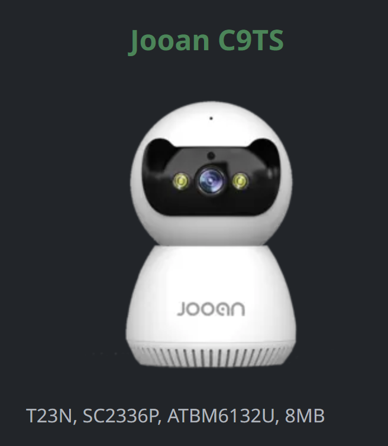

단, 오픈소스 펌웨어는 기기 모델이나 제조 시기에 따라 실제 분석 대상 기기와 파일 시스템 구조 및 칩셋 구성 등이 상이할 수 있다. 따라서 오픈소스 펌웨어는 참고 자료로 활용하되, 이를 실제 기기와 동일하다고 가정해서는 안 되며, 분석 시 이러한 차이를 반드시 고려해야 한다.

---

# 2. SPI 통신을 활용한 펌웨어 추출

펌웨어를 추출하기 전, 먼저 장치를 분해해 플래시 메모리 칩을 식별해야 한다. 본 실습 기기에서는 XM25QH64C 플래시 메모리 칩이 확인되었다. 

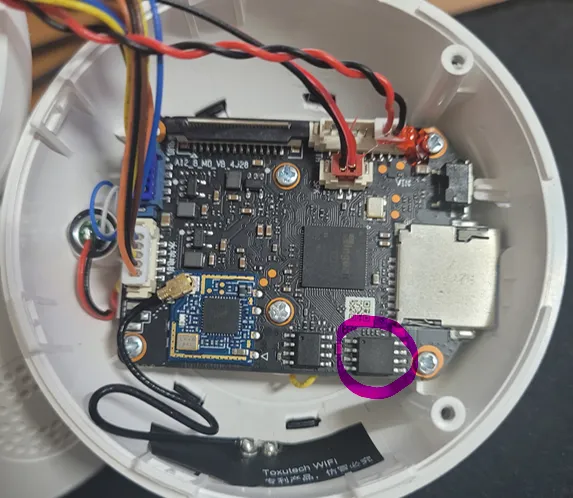

또한, Flashrom 통신 설정에 필요한 SPI 채널 구성, 전원·핀 배치, 칩 용량 등의 정보는 플래시 메모리 칩(XM25QH64C)의 데이터 시트에 포함되어 있으므로, 이를 사전에 조사해야 한다.

- **데이터 시트 확보 방법**
    1. 구글 검색 : 부품 파트명을 검색하면 쉽게 데이터 시트를 찾을 수 있다.
    2. (권장) 제조사 공식 사이트 : 보다 정확한 자료를 위해 제조사 공식 사이트에서 파트명을 검색해 다운로드한다.
    
    단, 동일한 파트명이라도 제조사가 다르면 스펙이 달라질 수 있으므로, 제조사와 모델명을 함께 확인하는 것이 중요하다.
    

## 2.1 Chip-off

플래시 메모리 칩이 보드에 장착된 상태에서는 인접 회로나 부품이 SPI 통신을 방해할 수 있으므로, 플래시 메모리 칩을 보드에서 분리(chip-off)한 후 펌웨어를 추출을 진행하였다. 

**Chip-off 장비 및 준비물**

| 장비 / 재료 | 용도 |
| --- | --- |
| 캡톤 테이프 (Kapton Tape) | SoC, 콘덴서, 저항 등의 주변 부품이 열에 손상되지 않도록 보호 |
| 납땜 워크 스페이스 (작업 매트 포함) | 정전기 방지 매트와 내열 작업 공간 확보 |
| 솔더 페이스트  | 납 흡착을 돕고 열 전달을 균일하게 해줌 |
| 열풍기  | 칩에 열을 가해 납을 녹이고 안전하게 칩 분리 수행 |
| 인두기  | 납 보충, 핀 리워크, 마무리 정리용으로 사용 |
| 납 제거기 | 납 제거를 위해 사용. 패드 손상 없이 잔여 납을 흡입함
 |

**Chip-off 작업 절차**

1. **주변 부품 보호**
    
    칩을 분리에 앞서, 기판 위의 SoC 및 주변 부품이 고온에 의해 손상되지 않도록 캡톤 테이프로 보호한다.
    
2. **Chip-off 준비**
    
    Chip-off는 납땜 워크 스페이스에서 진행하고, 플래시 메모리 하단에 솔더 페이스트를 도포한다.
    
3. **열 가열 및 칩 분리**
    
    열풍기로 칩에 일정한 열을 가해 납을 녹인 후, 핀 손상 없이 칩을 조심스럽게 들어올린다. 
    
    > 열풍기의 온도가 너무 높으면 칩에 손상이 생길 수 있으므로, 적정온도를 유지하는 것이 중요하다.
    > 
4. **SPI 연결 준비**
    
    분리한 플래시 메모리 칩을 라즈베리 파이 또는 롬 라이터에 맞는 소켓·핀 헤더에 연결해 SPI 통신을 구성한다. 
    
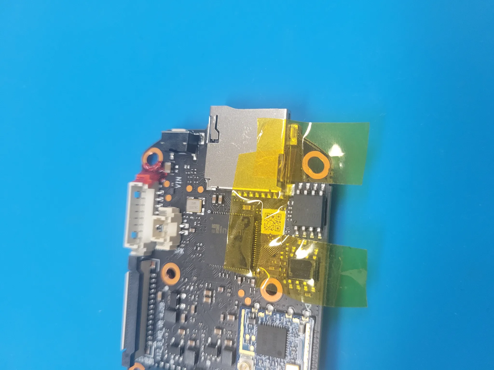
*<캡톤 테이프로 칩 주변 부품 보호>*


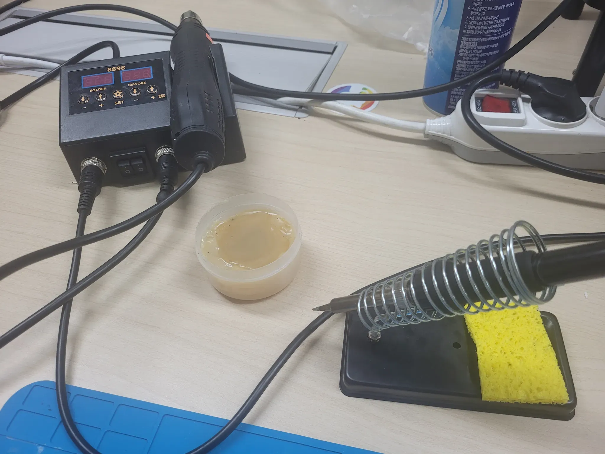
*<솔더 페이스트와 열풍기>*


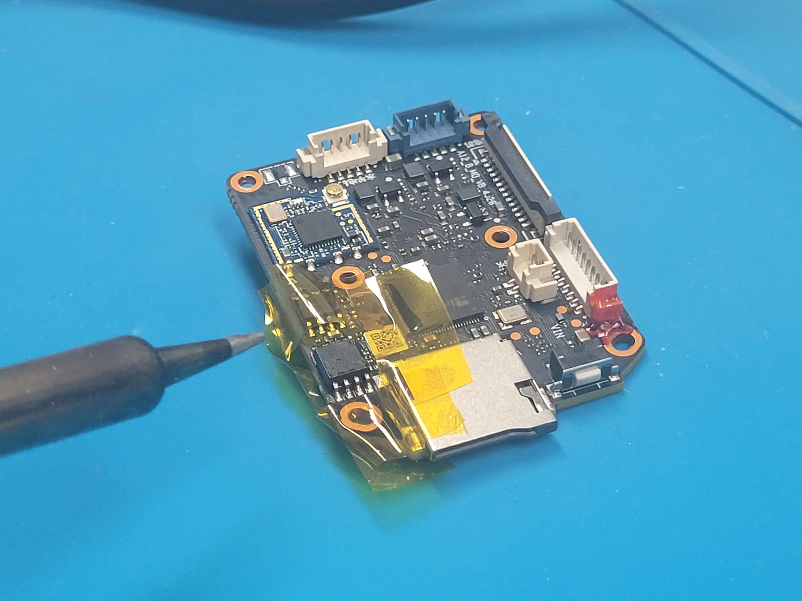
*<열풍기로 플래시 메모리 칩을 분리하는 모습>*


*<플래시 메모리 칩을 분리한 모습>*


## 2.2 데이터 시트 확인

확보한 플래시 메모리 칩의 데이터 시트를 참고하여 pin out을 확인한다. 
데이터 시트에는 칩에 대한 상세한 설명과 정보가 포함되어 있으니 반드시 확인해야 한다.

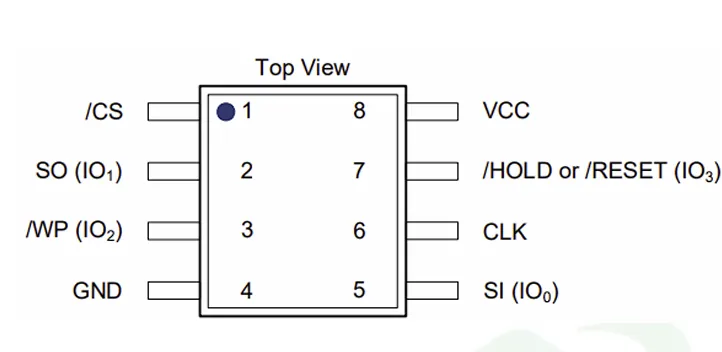  
*<XM25QH64C 기준>*

플래시 메모리의 8 pin은 각자 다른 역할을 수행한다.

- /CS : 칩 선택
- SO : 플래시 메모리에서 데이터를 출력
- /WP : 쓰기 보호로 이 핀 신호과 활성화 된 경우 플래시 메모리로 쓰기 불가
- GND : 접지, 기준 전압 공급
- VCC : 전원 공급
- /HOLD or /RESET : 칩 일시정지 혹은 초기화
- CLK : 직렬 클럭으로 SPI 통신 속도 제어 신호를 전달
- SI  : 플래시 메모리로 데이터를 입력

## 2.3 라즈베리 파이 활용

이 절에서는 chip‑off 방식으로 분리한 플래시 메모리 칩을 라즈베리 파이에 연결해 SPI 통신으로 데이터를 읽어오는 과정을 설명한다.

- **준비물**

| 항목 | 설명 |
| --- | --- |
| Raspberry Pi 4 | SPI 통신 및 GPIO 핀 제공 |
| 점퍼 케이블 | Flash 칩 ↔ Pi 연결용 |
| XM25QH64C (SPI NOR Flash) | 8핀, 8MB 용량 |
| Flashrom | 오픈소스 플래시 추출 도구 |

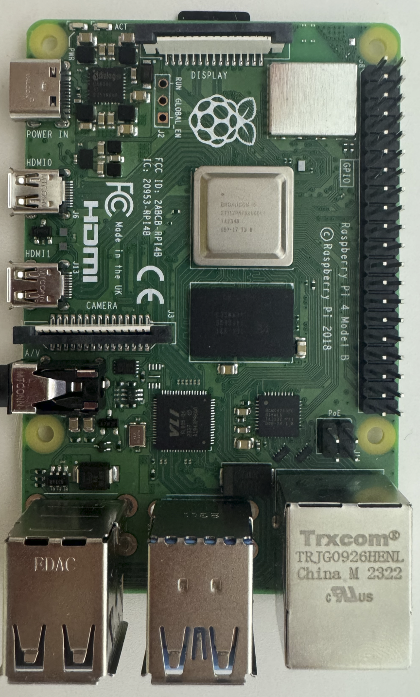
*<Raspberry Pi 4>*

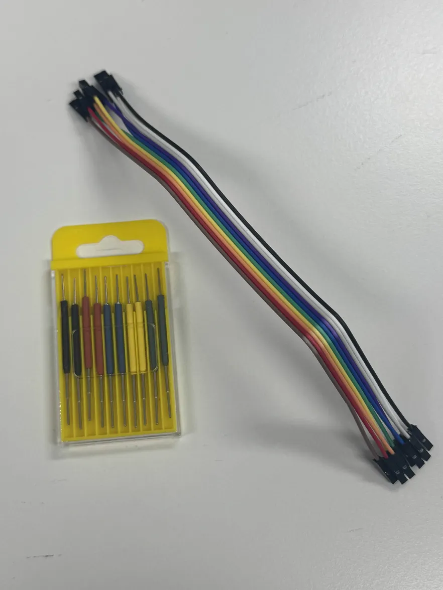
*<점퍼 케이블>*

점퍼 케이블

먼저 SPI 통신을 위해 라즈베리 파이 환경을 설정한다. 라즈베리 파이를 처음 사용하는 경우, 아래 과정을 따라 OS 세팅부터 진행해야 한다.

- **라즈베리 파이 OS 설정**
    1. **SD 카드 포맷**
    
    SD 카드를 USB 리더기를 통해 PC에 연결한다. Windows 탐색기에서 드라이브를 우클릭하고 포맷을 선택한다. 빠른 포맷으로 진행한다.
    
    2. **라즈베리 파이 OS 설치**
    
    Raspberry Pi Imager를 설치하고 실행한다.
    
    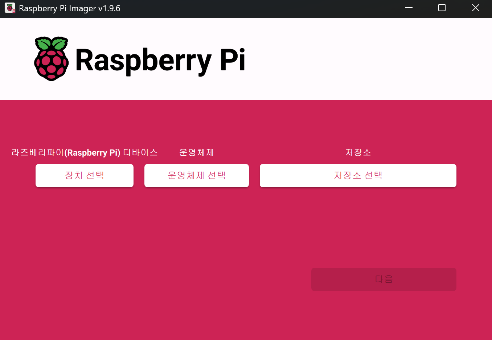
    
    - 장치 선택 : 사용 중인 라즈베리 파이 모델 (예 : Raspberry Pi 4)
    - 운영체제 선택 : 사용 중인 라즈베리 파이에 맞춰서 선택
        
        > 본 실습에서는 64비트 OS 선택
        
    - 저장소 : PC에 연결한 SD카드를 선택
    
    3. **OS 커스터마이징**
    
    원격으로 접속(SSH)하려면 OS 커스터마이징을 설정해야 한다.
    
    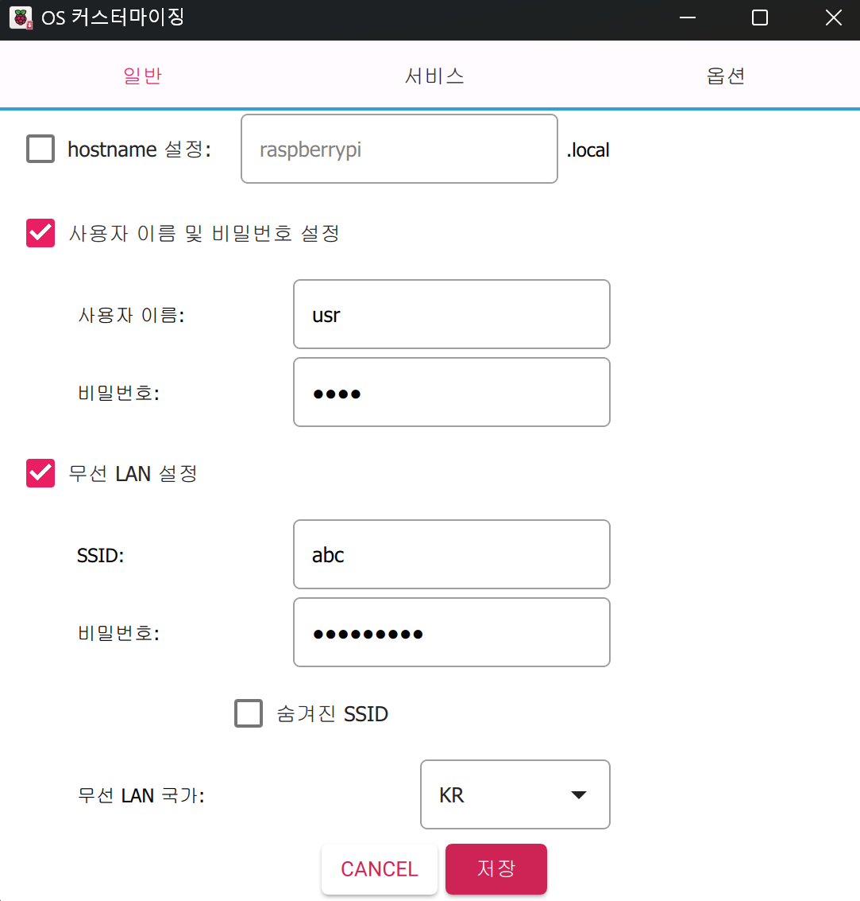
    
    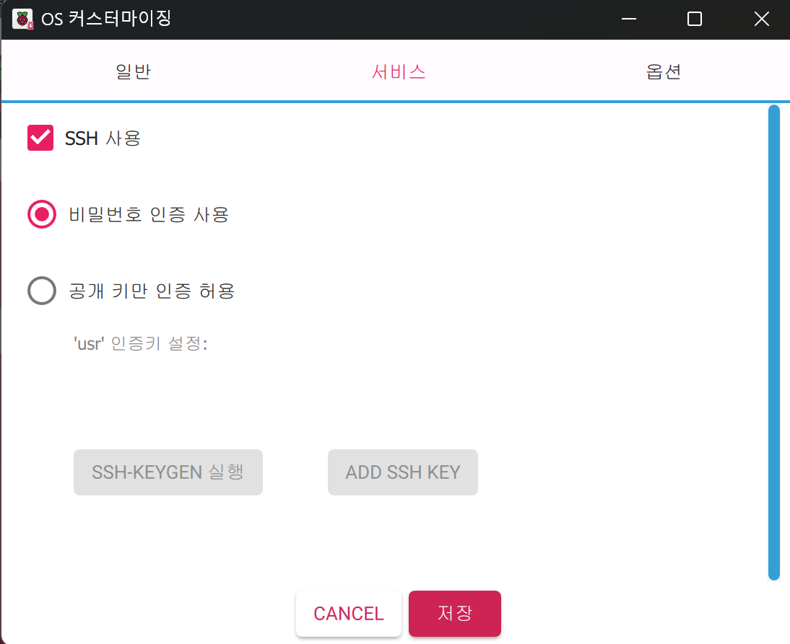
    
    - 사용자 계정 설정 : 사용자 이름과 비밀번호를 지정한다.
    - 네트워크 설정 : 라즈베리 파이가 부팅 시 자동으로 연결할 무선 네트워크와 비밀번호를 입력한다.
        
        > 라즈베리 파이가 PC와 같은 네트워크에 연결되어야 SSH 원격 접속이 가능하다.
        
    - SSH 활성화 : SSH 사용을 활성화하고, 비밀번호 인증으로 설정한다.
        
        > SSH를 활성화하면 PC에서 원격으로 라즈베리 파이에 접속해 작업할 수 있어, 별도의 모니터나 키보다 필요 없다.
        
    
    4. **부팅 및 접속**
    - SD 카드를 라즈베리 파이에 삽입하고 전원을 켠다.
    - 동일 네트워크 상에서 라즈베리 파이 IP 확인 후 SSH로 접속한다.
    
    위 과정을 통해 환경이 준비되면 GPIO 핀을 이용해 SPI 연결을 수행할 수 있다.
    

### 2.3.1 라즈베리 파이 GPIO 핀 연결

데이터 시트에서 확인한 플래시 메모리 pin out을 기준으로, 라즈베리 파이 GPIO핀과 플래시 메모리 pin을 매핑해 연결해준다.

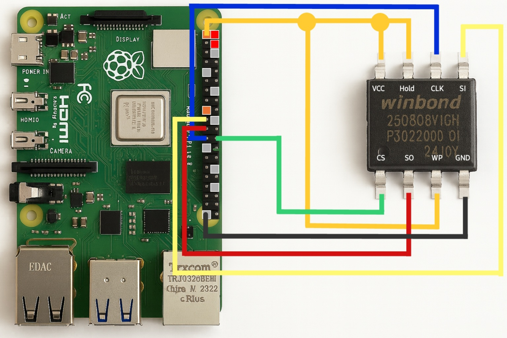

| Flash pin | GPIO 핀 번호 |
| --- | --- |
| VCC | 1번 |
| GND | 6번 |
| /CS | 24번 |
| CLK | 23번 |
| SO | 21번 |
| SI | 19번 |

먼저 /CS 핀(24번 핀)을 기준으로 잡고 나머지를 연결하면 실수가 줄일 수 있다. 또한 WP와 HOLD 핀은 활성화하면 쓰기, 읽기 보호가 되기 때문에 칩 인식이 안될 수도 있다. 따라서 VCC에 묶어 비활성화 상태로 설정해야 한다. 

> 전원을 연결하기 전에 반드시 배선이 정확한지 확인하고, 케이블이 흔들리지 않게 고정해야 한다.


### 2.3.2 SPI 인터페이스 활성화

플래시 메모리와 통신하려면 라즈베리 파이에서 SPI 기능을 켜야 한다. SPI는 기본적으로 꺼져 있으므로 raspi-config에서 활성화 한다.

1. **터미널에서 설정 메뉴 실행**

```bash
sudo raspi-config
```

- `sudo`: 관리자 권한으로 실행
- `raspi-config`: 라즈베리 파이 기본 설정

2. **Interface Options → SPI → Enable 선택**

SPI는 플래시 메모리와 데이터를 주고받는 통신 방식으로 이를 활성화 해야 SPI 통신을 할 수 있다.

3. **재부팅**

```bash
sudo reboot
```

설정 사항을 적용하기 위해  라즈베리 파이를 재부팅한다.

4. **SPI 모듈 로드 확인**

```bash
lsmod | grep spi
```

- `lsmod`: 현재 로드된 커널 모듈을 확인
- `grep spi`: 출력 중 SPI 관련 항목만 찾아서 출력

아래와 같이 출력되면 정상적으로 활성화된 것이다.

```bash
spi_bcm2835     20480  0
spidev          20480  0
```

### 2.3.3 Flashrom 설치 및 플래시 메모리 덤프

앞서 추출 방법론에서 소개한 Flashrom을 사용해 펌웨어를 추출한다. 라즈베리 파이에서 소스코드를 빌드하는 방식으로 설치할 수 있다.

1. **의존 패키지 설치**

```bash
sudo apt-get install -y \
  gcc \
  meson \
  ninja-build \
  pkg-config \
  python3-sphinx \
  libcmocka-dev \
  libpci-dev \
  libusb-1.0-0-dev \
  libftdi1-dev \
  libjaylink-dev \
  libssl-dev
```

- `gcc`: C 컴파일러
- `meson, ninja`: 빌드 도구
- `libftdi, libusb`: USB/SPI 장치 접근 라이브러리

2. **flashrom 소스 코드 다운로드**

```bash
git clone https://github.com/flashrom/flashrom 
```

3. **빌드 및 설치**

```bash
# 빌드 환경 구성
meson setup build

# 소스 코드 컴파일
meson compile -C build

# 빌드 결과 테스트
meson test -C builddir

# 시스템에 설치
sudo meson install -C build 
```

4. **플래시 메모리 칩 인식 확인**

라즈베리 파이와 플래시 메모리가 정상적으로 연결되었는지, flashrom에서 지원하는 칩인지 확인한다.

```bash
# 연결 확인 및 Chip 명 확인
sudo flashrom -p linux_spi:dev=/dev/spidev0.0,spispeed=2000 -V
```

- `p linux_spi`: 라즈베리 파이의 SPI 인터페이스 사용
- `dev=/dev/spidev0.0`: SPI 디바이스 경로 지정
- `spispeed=2000`: 통신 속도를 2MHz로 설정
- `-V`: 실행 과정을 상세하게 출력

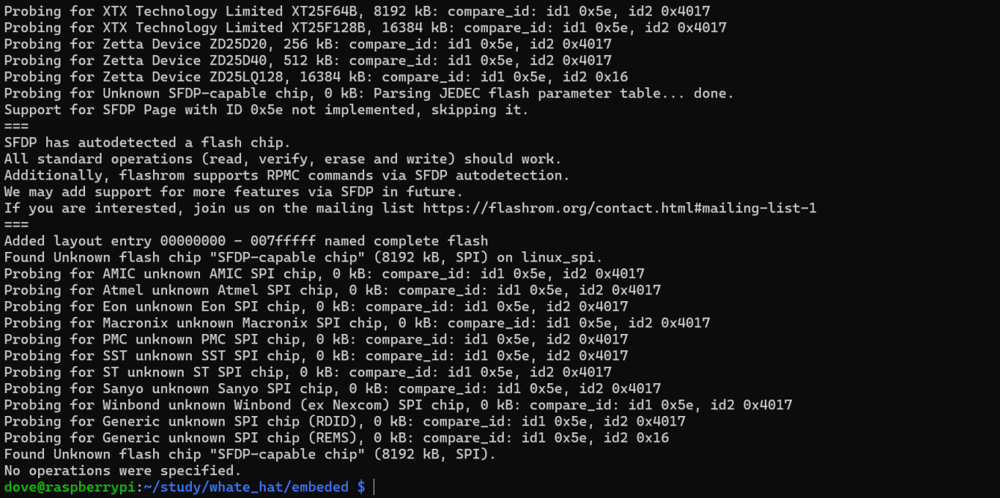

칩이 정상적으로 인식되면 터미널에 `Found` 로 시작하는 메시지가 출력된다.

5. **펌웨어 추출**

```bash
# 추출
sudo flashrom -p linux_spi:dev=/dev/spidev0.0 -r [저장파일명]
```

추출을 완료되면 아래와 같이 플래시 메모리 읽기 완료 메시지가 출력된다. 

```bash
Found Generic flash chip "XM25QH64C" (8192 kB, SPI).
Reading flash... done.
```

추출된 펌웨어 파일은 Binwalk 등의 분석 도구를 활용하여 바이너리 내부 구조를 분석할 수 있다. 

## 2.4 롬 라이터 활용

이 절에서는 chip‑off 방식으로 분리한 플래시 메모리 칩을 롬 라이터에 연결해 SPI 통신으로 데이터를 읽어오는 과정을 설명한다.

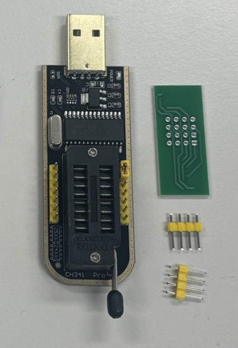

위 사진은 본 문서에서 실제로 펌웨어를 추출할 때 사용한 CH341A 롬 라이터의 모습이다.

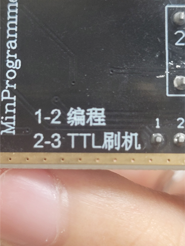

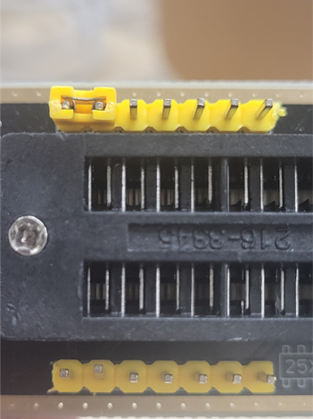

PCB 상에 “1‐2 编程(Programming)” 및 “2‐3 TTL 刷机(Flashing via TTL)”라고 인쇄되어 있는 것을 확인할 수 있다. 이는 1–2 핀 연결 시 프로그래밍 모드(EPP/MEM/I²C 등 복합 모드), 2–3 핀 연결 시 TTL/직렬 모드로 동작 모드를 전환 가능함을 의미한다. 펌웨어 추출을 위해선 점퍼 캡을 1–2 핀에 연결해야 EPP/MEM/I2C mode로 인식되어 flashrom을 통한 펌웨어 덤프가 가능하다. 

### 2.4.1 플래시 메모리 칩과 SOP 보드 연결

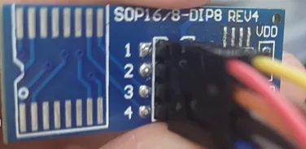

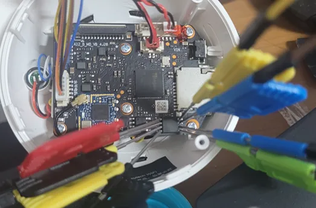

플래시 칩의 1번 핀(● 실크·홈 표시) 이 SOP 보드의 1번 위치와 일치하도록 후크 클립을 장착하고 1번 위치부터 반시계방향으로 2·3·…·8번 핀도 SOP 보드의 번호와 그대로 대응하도록 연결한다. 

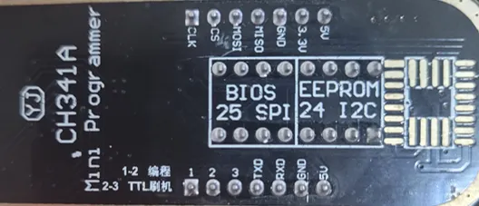

CH341A 기판 뒷면에 인쇄된 “25” / “24” 표기는 Flash 메모리 시리즈 규격을 나타낸다.

- 25 시리즈 = SPI NOR/NAND 플래시 (W25Q128JV, MX25L6406E 등)
- 24 시리즈 = I²C EEPROM (24LC256 등)

본 실습의 대상은 25 시리즈이므로 SPI 핀아웃(3.3 V, GND, MOSI, MISO, CLK, /CS)에 SOP 보드를 연결한다.

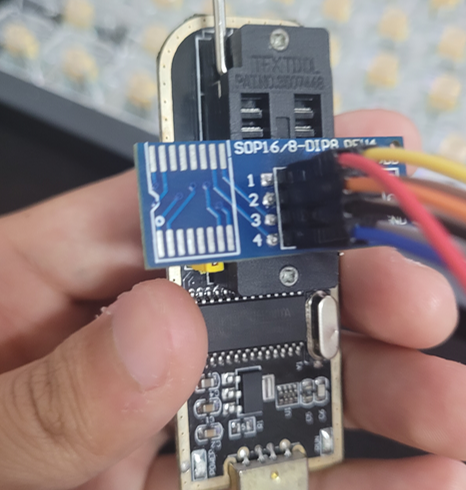

SOP 보드를 연결 하고 레버를 눕혀 고정한다. 

### 2.4.2 PC 연결 및 USB 패스스루

CH341A를 USB 포트에 꽂으면 아래와 같이 장치가 인식된다.

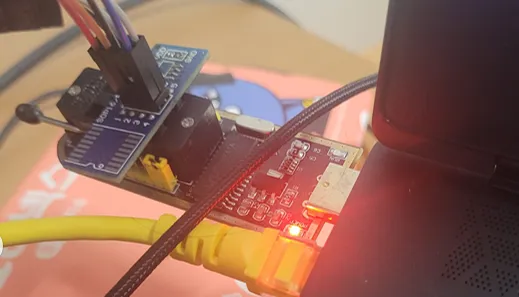

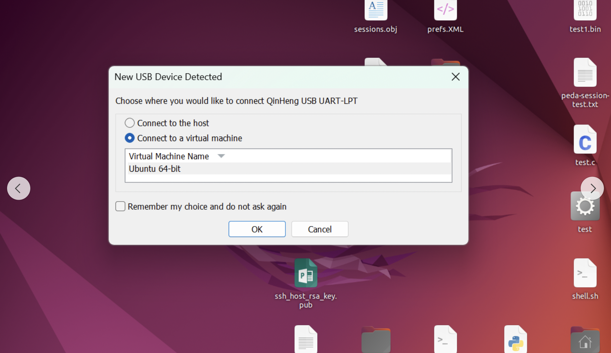

본 실습에선 VMware를 사용해서 진행하였으며 “Connect to a virtual machine” 를 선택해 게스트 OS로 패스스루하였다. 

### 2.4.3 Flashrom 활용 메모리 덤프

CH341A 롬 라이터를 사용해 플래시 메모리 데이터를 읽기 위해 Flashrom을 설치하고 실행한다.

1. **의존성 패키지 설치**

```bash
sudo apt update
sudo apt install libusb-1.0-0-dev   
```

- `libusb-1.0-0-dev`: USB 장치와 통신하기 위한 라이브러리로, CH341A 롬 라이터를 인식하기 위해 필수로 설치해야 한다.

2. **Flashrom 소스 코드 다운로드 및 빌드**

```bash
git clone https://github.com/flashrom/flashrom
cd flashrom

# 빌드 환경 설정
sudo meson setup builddir

# 소스 코드 컴파일
sudo meson compile -C builddir

# 빌드 결과 테스트
sudo meson test -C builddir

# 시스템에 설치
sudo meson install -C builddir
```

3. **펌웨어 추출**

```bash
sudo flashrom --programmer ch341a_spi --read [저장 파일명]
```

- `--programmer ch341a_spi`: CH341A 롬 라이터를 사용하도록 지정.
- `--read [저장 파일명]`: 플래시 메모리 내용을 지정한 이름으로 저장한다.

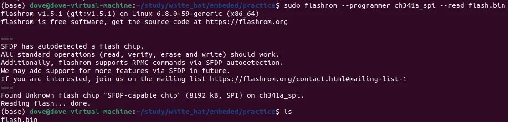

추출이 완료되면 위와 같은 완료 메시지가 출력된다.

---

# **✅ 완료 판단 기준**

- [ ]  Flashrom 로그에 **“Reading flash… done”** 표시되었는가?
- [ ]  추출한 바이너리 파일 크기가 칩 용량과 일치하는가?
 (XM25QH64C 기준으로는 약 8 MB가 되어야 덤프 성공)
- [ ]  (권장)  여러번 덤프 해서 ‘sha256sum flash*.bin’ 값이 일치하는지 확인

# **✅** 오류 해결 가이드

1. SPI 통신을 활용한 펌웨어 추출 시(라즈베리 파이, 롬 라이터 공통)
    - `No EEPROM/flash device found` (칩 인식 실패)
        
        GND 또는 /CS 접촉 불량 혹은 WP/HOLD 핀을 VCC에 연결하지 않으면 칩 인식에 실패할 수 있다. 이를 해결하기 위해서 GND /CS 핀을 다시 꽂아 확실히 고정되었는지 확인하고 WP/HOLD 핀을 VCC에 연결하여 비활성화한다.
        
    - `Permission denied`
        
        SPI 디바이스 접근 권한 부족 또 sudo 누락이 원인으로 `sudo` 명령으로 재실행하거나  `/dev/spidev0.0` 권한을 수정한다.
        
    - Meson 버전 오류
        
        Flashrom 빌드 과정에서 최신 버전에서 문제가 생길 수 있으므로, flashrom을 v1.5.1으로 되돌린 뒤 다시 빌드한다.
        
        > 기존 빌드 디렉토리가 있다면 삭제 후 재설정해야 한다.
        > 
    
    ```bash
    git checkout v1.5.1                 # 버전 전환
    rm -rf builddir                     # 기존 빌드 디렉토리 삭제
    meson setup builddir --reconfigure  # 빌드 환경 다시 설정
    meson compile -C builddir
    ```
    
2. 롬 라이터를 이용한 펌웨어 추출 시
    - WSL 환경 인식 불가
        
        WSL에서는 USB 장치를 직접 인식하지 못하므로 CH341A 사용이 어렵다. 따라서 VMware / VirtualBox 또는 네이티브 리눅스 환경을 권장한다.
