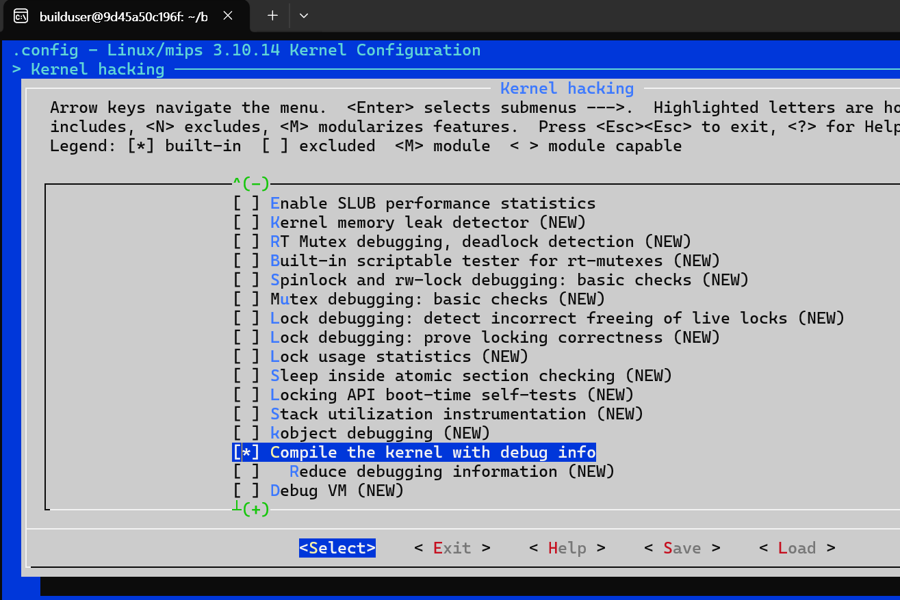

# 4. 동적 분석을 위한 환경 구축

### **시작하는 글**

이전 문서에서 binwalk를 통해 펌웨어를 분석하고 루트 파일시스템 분석을 통해 부팅 흐름을 정리했었다. 이번 글에서는 타겟 장비인 Jooan 사의 홈캠을 대상으로, QEMU 기반의 에뮬레이션 환경을 구축함으로써 실제 하드웨어 없이도 동적 분석이 가능하도록 한다. 이를 위해 Buildroot를 활용하여 Linux 3.10.14 커널 이미지를 생성하고, gdbserver를 포함한 사용자 정의 파일 시스템을 구성하여 QEMU 상에서 실시간 디버깅이 가능한 환경을 마련하였다. 또한, 펌웨어에 포함된 경량 웹서버 goahead를 구동시켜 웹 인터페이스에 접속하고, gdbserver를 통해 리모트 환경에서 웹서버의 동작을 추적·분석할 수 있도록 했다.

본 문서의 구성은 다음과 같다. 1. buildroot를 이용해 커널이미지를 생성하고, 2. QEMU 부팅 시 사용할 파일 시스템을 구성한다. 마지막으로 3. QEMU 환경에서 gdb 연결과 웹서버 분석에 대해 다룬다.

## 4.1 Builldroot를 통한 Linux 3.10.14 커널이미지 생성

### **✅ 준비사항**

- [ ]  펌웨어 확보가 완료됐는가?
- [ ]  펌웨어의 커널이미지 정보가 확인됐는가?
    - [ ]  커널 버전을 확인됐는가?

**Buildroot란?**

https://github.com/buildroot/buildroot

Buildroot는 임베디드 리눅스 시스템을 자동으로 생성하는 오픈소스 빌드 시스템으로, 크로스 컴파일 도구체인, 커널, 루트 파일 시스템(rootfs), 라이브러리, 유틸리티, 애플리케이션 등을 하나의 설정 파일로부터 자동으로 빌드해준다.

획득한 펌웨어의 커널 이미지는 Linux version 3.10.14로 확인되었다. 따라서 커널 버전이 다름으로써 발생하는 호환성 문제를 방지하고 최대한 원본 펌웨어와 동일한 환경 구축을 위해 원본 펌웨어와 동일한 커널 이미지를 생성하여 에뮬레이션을 진행한다.  


### **4.1.1 도커 환경 구축**

MIPS Malta 보드 지원이 안정화된 버전인 Buildroot 2016.02 버전을 통해 빌드를 진행했다.

buildroot 2016.02 과의 버전 호환성 및 안전성을 이유로 Docker를 이용한 ubuntu 16.04에서 빌드를 진행한다. 

다음의 Dockerfile을 이용한다.

```python
FROM ubuntu:16.04

#     빌드에 필요한 모든 필수 도구들을 미리 설치
#    (apt-get이 non-interactive 모드로 실행되도록 설정)
ENV DEBIAN_FRONTEND=noninteractive
RUN apt-get update && apt-get install -y \
    build-essential \
    git \
    libncurses5-dev \
    bc \
    unzip \
    cpio \
    fakeroot \
    cmake \
    m4 \
    wget \
    sudo \
    libssl-dev \
    --no-install-recommends

#  sudo 권한을 가진 빌드용 사용자 생성
RUN useradd -m -s /bin/bash builduser && \
    echo "builduser:builduser" | chpasswd && \
    adduser builduser sudo

#  사용자를 builduser로 전환
USER builduser
WORKDIR /home/builduser

# 이 컨테이너가 실행될 때 기본으로 실행할 명령어
CMD ["/bin/bash"]
```

`docker build -t my-build-env .`  명령어를 통해 이미지를 빌드하고,

`docker run -it --rm my-build-env` 명령어로 컨테이너를 실행한다.

- CA 인증서 설치
    - wget, curl, git, apt 등 HTTPS 요청을 할 때 리눅스 시스템이 사이트의 인증서를 신뢰할 수 있는 지 판단해야 하기 때문에 시스템이 공인된 CA 인증서 목록을 가지고 있어야한다.
    - Docker 컨테이너에 기본으로 CA 인증서가 포함되어 있지 않기 때문에 설치해준다.

```python
sudo apt udpate
sudo apt install ca-certificates
```

### 4.1.2 buildroot 설치 및 기본 설정

- buildroot 2016.02 버전 설치

다음 명령어로 2016.02 버전 buildroot를 받고 압축을 해제한 후, 해당 폴더로 이동한다.

```bash
wget https://buildroot.org/downloads/buildroot-2016.02.tar.gz
tar -xvf buildroot-2016.02.tar.gz
cd buildroot-2016.02/
```

```jsx
make list-defconfigs
```

위 명령어를 통해 현재 Buildroot 버전에서 사용할 수 있는 defconfig 파일의 목록을 다음과 같이 확인할 수 있다.


다음으로 

```jsx
make qemu_mipsel_malta_defconfig
```

위 명령어를 통해 QEMU에서 MIPS 32bit little endian 환경(malta 보드)을 위한 기본 설정을 적용해준다.

- 이전에 우리는 펌웨어의 아키텍처가  MIPS  32bit little endian 이라는 것을 확인했다. MIPS 아키텍처, 32bit little endian을 사용할 경우 QEMU에서는 malta와 mipssim 2가지 머신을 지원하고, 이 중에서 일반적으로 실험이나 에뮬레이션에 적합한 머신인 malta를 사용하는 것이 적절하다고 판단했다.

---

### **4.1.3 세부 옵션 설정**

`make menuconfig` 를 통해 세부 옵션을 설정해줄 수 있다.


- Kernel 메뉴에서 Kernel version을 3.10.14로 설정해준다.
- Kernel compression format을 lzma compression으로 설정해준다.
- QEMU MIPS Malta 타겟의 표준 커널 이미지 포맷에 따라 Kernel binary format을 uImage → vmlinux로 변경해준다.

`make menuconfig` →Toolchain → Custom kernel headers series를 3.10.x 로 설정해준다.


Enable C++ support, Thread library debugging 활성화해준다.


Enable C++ support, Thread library debugging 을 활성화 시켜야  

Target packages → Debugging, profiling and benchmark → gdb가 활성화 된다.

gdbserver를 포함하여 커널 이미지를 빌드하기 위해 다음과 같이 활성화해준다.

```python
Target packages  --->
  Debugging, profiling and benchmark  --->
    [*] gdb
    [*] gdbserver
```


디버깅 심볼을 포함하여 빌드하기 위해 

- Build options → build pakages with debugging symbols를 활성화한다.
- strip command for binaries on target을 none으로 설정해준다.


Filesystem images→ ext2/3/4 root filesystem이 활성화 되어있지 않다면 활성해주고, ext2/3/4 variant에서 ext4로 설정해준다.


`make linux-menuconfig`를 통해 리눅스 커널 설정을 하기 위해서 다음과 같이 python과 rsync를 설치해줘야 한다.

rsync는 파일과 디렉토리를 효율적으로 동기화(sync)해주는 유틸리티로, Buildroot는 출력 디렉토리로 파일을 복사하거나 패키지 소스 정리 등 작업에 rsync를 내부적으로 사용한다고 한다.

```python
sudo apt install python # python 2.7.17 version
sudo apt install rsync 
```

마지막으로 Docker에서 로케일 설정을 해준다.

```python
sudo apt install locales

sudo locale-gen en_US.UTF-8

sudo update-locale LANG=en_US.UTF-8
```

여기까지 따라왔다면 `make linux-menuconfig`가 동작한다

`make linux-menuconfig`  → Filesystem에서 다음과 같이 활성화해준다.


`make linux-menuconfig` → Kernel Hacking 에서 Kernel debugging을 다음과 같이 활성화해준다.


`make linux-menuconfig` → Kernel Hacking 에서 compile the kernel with debug info를 활성화해준다.



`make menuconfig` → Filesystem images ext2/3/4 rootfile system → ext2/3/4 variant (ext4) 로 설정해준다.


`Save` 를 통해 저장해주고 `make` 를 통해 빌드

결과적으로 다음과 같이 output/images/ 디렉터리에 vmlinux가 생성된 것을 확인할 수 있다.


또한 strings 명령어를 통해 vmlinux 파일 내의 리눅스 버전 정보를 확인함으로써 의도한 3.10.14 버전의 커널 이미지라는 것을 확인했다.


### **✅ 완료 판단 기준**

- [ ]  buildroot에서 make를 통해 output/images 경로에 vmlinux가 생성됐는가?
- [ ]  MIPS 아키텍처 및 not stripped 형태로 생성됐는가?
- [ ]  linux version이 원본 펌웨어와 동일(Linux version 3.10.14)한가?

---

## 4.2 파일 시스템 구성

### **Preliminaries**

- [ ]  펌웨어 확보가 완료됐는가?
- [ ]  펌웨어의 파일시스템 정보가 확인됐는가?
    - [ ]  파일시스템의 포맷을 파악했는가?

### 4.2.1 `qemu_rootfs` 디렉토리 구성

QEMU 부팅 시 사용할 ext4 파일 시스템을 만들고, 추출한 펌웨어 파일들을 옮겨 적재하는 과정이다.

> 파일 시스템을 사용하기 전에 반드시 마운트 디렉토리를 생성하고 `-o loop` 옵션으로 마운트한다.
마운트한 파일 시스템은 작업이 끝난 후 반드시 `umount`해야 한다.
> 

1. **128MB 크기의 빈 파일 생성**
→ 이 파일이 QEMU에서 사용할 가상 디스크가 된다.
    
    ```bash
    dd if=/dev/zero of=rootfs2.ext4 bs=1M count=128
    ```
    
    - `of=rootfs2.ext4` : 출력 파일 이름
    - `bs=1M count=128` : 1MB 블록을 128개. 즉, 128MB로 설정한다.
    
2. **ext4 파일 시스템으로 포맷**
    
    현재 빌드된 Linux 3.10.14 MIPS 커널은 squashfs, jffs2를 지원하지 않는다. 따라서 지원 가능한 파일 시스템인 ext4 파일 시스템으로 구성한다.
    
    ```bash
    mkfs.ext4 rootfs2.ext4
    ```
    
    ext4 형식으로 포맷한다. 이후 이 파일에 마운트하여 파일을 복사할 수 있다.
    

3. **임시 마운트 폴더 생성**
    
    ```bash
    mkdir qemu_rootfs
    ```
    
    마운트 시 사용할 디렉토리를 만들어 준다.
    

4. **ext4 이미지 마운트**
    
    ```bash
    sudo mount -o loop rootfs2.ext4 qemu_rootfs/
    ```
    
    `-o loop` 옵션을 통해 파일을 디스크처럼 마운트한다.
    

5. **펌웨어에서 추출한 파일 시스템 복사**
    
    펌웨어 분석 결과, 아래와 같이 세 가지 파일 시스템이 추출되었다.
    
    | 오프셋 위치 | 파일 시스템 | 마운트 위치 (target) |
    | --- | --- | --- |
    | `0x1B8000` | `squashfs-root` | `/` |
    | `0x488000` | `squashfs-root` | `/mnt/mtd` |
    | `0x798000` | `jffs2-root` | `/opt` |
    
    아래 명령어로 각각의 파일들을 적절한 위치에 복사한다.
    
    ```bash
    # 루트 파일 시스템 복사
    sudo cp -a squashfs-root/* qemu_rootfs/
    
    # /mnt/mtd 구성
    sudo cp -a squashfs-1/* qemu_rootfs/mnt/mtd
    
    #/opt 구성
    sudo cp -a jffs2-root/* qemu_rootfs/opt
    
    # 권한 설정 (루트 권한 보장)
    sudo chown -R root:root qemu_rootfs/
    ```
    
    > `cp -a` 옵션은 권한, 소유자, 심볼릭 링크 등도 그대로 유지하면서 복사하는 명령어이다.
    
    
    최종적으로 구성된 디렉토리 구조는 다음과 같다.
    
    ```
    qemu_rootfs/
    ├── bin/
    ├── config/            
    ├── dev/
    ├── etc/
    ├── jpeg/
    ├── lib/
    ├── linuxrc
    ├── lost+found/
    ├── media/
    ├── mnt/
    ├── opt/               
    ├── proc/
    ├── root/
    ├── run/
    ├── sbin/
    ├── startapp          
    ├── sys/
    ├── system/
    ├── tmp/
    ├── ttf/
    ├── usr/
    ├── var/
    ├── jzstart.sh       
    ├── VoiceGuide/
    ├── aging_test/
    ```
    

---

### 4.2.2 QEMU 루트 비밀 번호 제거

QEMU에서 부팅 후 `root`계정으로 로그인할 때 비밀번호 입력을 요구한다. 자동 로그인 또는 편한 접근을 위해, 미리 `root`계정의 비밀번호를 제거해준다.

1. **/etc/shadow 파일 수정**

```bash
sudo vi qemu_rootfs/etc/shadow
```

> /etc/shadow 파일은 시스템 설정 파일로, 반드시 `sudo`를 붙여야 편집할 수 있다.
> 
> 
> 권한 없이 열면 읽기 전용으로 열리기 때문에 저장이 불가능하며, 내용을 수정할 수 없다.
> 

<수정 전 /etc/shadow>

```
root:$5$HvUmiKay8JugO17C$gazQrgfxANwpkKuzhKvE0.KVTWrS53cyVLsm8yiSkrC:10933:0:99999:7:::
```

<수정 후 /etc/shadow>

```
root::10933:0:99999:7:::
```

root: 다음에 나오는 `$5$…` 값은 SHA-256 해시된 비밀번호이다. 이 값을 지워야 비밀번호 없이 로그인할 수 있다.

2. **마운트 해제**

수정이 끝났으면 반드시 마운트를 해제해야 한다.

```bash
sudo umount qemu_rootfs
```

---

### 4.2.3 `gdbserver` 확보

**gdbserver란?**

gdbserver는 임베디드 시스템이나 원격 시스템에서 디버깅 대상 프로그램을 GDB로 디버깅할 수 있게 해주는 서버 프로그램이다. gdbserver는 타겟 장치(QEMU)에서 실행하고 gdb를 호스트 PC에서 실행해서 리모트 환경에서 프로그램을 디버깅할 수 있다.

펌웨어에서 추출한 파일 시스템에는 기본적으로 `gdbserver`가 포함되어 있지 않으므로, QEMU 환경에서 동적 분석을 수행하려면 `gdbserver`를 수동으로 추가해야 한다.

그러나 이 과정에서 동적 링크된 `gdbserver` 파일을 사용한다면 런타임 의존성 문제가 발생할 수 있다. 동적 로더와 공유 라이브러리의 버전·ABI가 펌웨어에 포함된 것과 정확히 일치하지 않으면 실행 환경을 맞추기 위한 추가 구성과 검증이 필요해지고, 펌웨어마다 요구 사양이 달라 매번 대상에 맞는 `gdbserver` 라이브러리 세트를 별도로 구해 배치해야 하는 부담이 커진다.
이러한 잠재적인 문제들을 사전에 방지하기 위해 본 실습에서는 정적(Static) 링크된 `gdbserver`를 사용했다. 정적 바이너리는 필요한 표준 라이브러리를 바이너리 내부에 포함하므로 용량이 큰 대신 별도의 로더·공유 라이브러리를 설치하지 않아도 되고, 읽기 전용 또는 제한적인 오버레이 환경에서도 바이너리만 배치하면 즉시 실행 가능하다는 장점을 갖는다. 

> 단, 정적 링크 gdbserver라 하더라도 아키텍처는 대상과 일치해야 한다.
> 

이러한 정적 `gdbserver`를 얻는 방법은 두 가지가 있다. 교차 툴체인으로 직접 빌드하거나, 미리 빌드된(prebuilt) 정적 바이너리를 활용하는 것이다. 본 실습에서는 후자의 방법으로 진행하였다. 


<https://github.com/stayliv3/gdb-static-cross/tree/master/prebuilt>
다양한 아키텍처에 대한 정적 gdbserver 파일들이 제공되고 있으므로, 자신이 분석하고 있는 펌웨어에 맞는 버전의 gdbserver 파일을 다운로드하여 사용할 수 있다. 

본 실습에서 분석한 펌웨어는 MIPS-32bit, Little endian을 사용중이었기에, 해당 조건에 부합하는 gdbserver 파일인 `gdbserver-7.7.1-mipsel-mips32-v1: ELF 32-bit LSB executable, MIPS, MIPS32 version 1 (SYSV), statically linked` 파일을 내려받아 사용했다.  

이와 같은 방법을 사용하면 라이브러리/로더 의존성으로 인한 시행착오를 줄이고, 다양한 펌웨어에 대해 일관된 디버깅 환경을 빠르게 구축할 수 있다.

### 4.2.4 파일 시스템에 `gdbserver`추가

이 단계에서는 구한 gdbserver 파일을 앞서 만든  QEMU용 파일 시스템에 추가하는 방법에 대해 다룬다. 

 

1. **`gdbserver` 파일 복사**

이제 QEMU에서 사용할 파일 시스템(`qemu_rootfs`) 디렉토리에 복사한다.

```bash
# gdbserver를 복사하기 위해 rootfs2.ext4를 다시 마운트
sudo mount -o loop rootfs2.ext4 qemu_rootfs/

sudo cp rootfs_buildroot/temp/usr/bin/gdbserver qemu_rootfs/usr/bin/
```

> 임의로 usr/bin 경로에 복사한 것이고 /bin 경로에 복사해도 상관없다.
> 

---

2. **마운트 해제**

```bash
sudo umount qemu_rootfs
```

3. **ext4 파일 시스템의 저널링 제거** 

ext4 파일 시스템은 기본적으로 저널링 기능이 활성화되는데, 일부 커널은 이 기능을 지원하지 않아 커널 패닉이 발생할 수 있다. 따라서 아래 명령으로 미리 저널링을 제거해준다.

```bash
sudo tune2fs -O ^has_journal rootfs2.ext4
sudo e2fsck -f rootfs2.ext4
```

- `^has_journal`: 저널링 기능 제거
- `e2fsck`: 파일 시스템 무결성 검사 및 복구

### **✅** 완료 판단 기준

- [ ]  file 명령어로 확인한 gdbserver의 아키텍처가 커널의 아키텍처와 일치하는가?
- [ ]  수정된 파일 시스템을 사용하여 qemu 에뮬레이팅을 진행했을 때 에뮬레이팅에 성공했는가?
- [ ]  에뮬레이팅 이후 gdbserver 실행이 정상적으로 진행되었는가?

---

## 4.3 QEMU 환경에서 gdb 연결 & 웹서버 분석

앞서 만든 QEMU에 올릴 파일 시스템(`rootfs2.ext4`)을 사용하여 QEMU를 실행할 수 있다. Buildroot에서 생성한  커널(vmlinux)과 직접 구성한 파일 시스템을 연결하면, QEMU 가상 머신에서 시스템을 부팅하고 디버깅 환경을 구성할 수 있다.

### **✅ 준비사항**

- [ ]  커널이미지가 확보됐는가?
- [ ]  파일시스템이 확보됐는가?
- [ ]  gdbserver가 추가된 파일시스템을 마운트했는가?
- [ ]  커널이미지와 파일시스템을 기반으로 QEMU 로드가 잘 됐는가?
- [ ]  QEMU 실행 명령에서 gdbserver를 위한 포트를 지정했는가?

### 4.3.1 커널 디버깅

본 실습에 사용된 커널 이미지는 MIPS 아키텍처 기반으로  호스트의 아키텍처와 일치하지 않는다. 이 경우 기본 gdb로는 디버깅에 어려움이 있을 수 있어, 여러 CPU 아키텍처를 지원하는 gdb-multiarch의 사용이 필요하다. gdb-multiarch는 크로스 디버깅이 가능하도록 빌드된 gdb로, 호스트와 디버깅 대상의 아키텍처가 서로 달라도 디버깅 수행이 가능하다.

1. **gdb-multiarch 설치**

```bash
sudo apt install gdb-multiarch
```

2. **QEMU 실행**

```bash
qemu-system-mipsel \
  -M malta \
  -kernel vmlinux \
  -drive file=rootfs.ext4,format=raw,if=ide \
  -append "root=/dev/hda rw console=ttyS0 init=/sbin/init" \
  -netdev user,id=eth0,hostfwd=tcp::8080-:80 \
  -device pcnet,netdev=eth0 \
  -nographic \
  -s -S
```

- `-M malta` : MIPS 아키텍처의 Malta 보드 에뮬레이션
- `-kernel vmlinux` : Buildroot에서 생성한 커널 파일 사용
- `-drive file=rootfs2.ext4,...` : QEMU에 올릴 ext4 파일 시스템 마운트
- `-append` : 커널 부트 인자 설정
- `root=/dev/hda` : QEMU에서 root 디바이스를 `/dev/hda`로 지정
- `rw` : 파일 시스템을 read/write 모드로 마운트
- `console=ttyS0` : 시리얼 콘솔을 사용해 QEMU 출력 보기
- `init=/sbin/init` : 부팅 시 실행할 초기화 프로그램 지정
- `-netdev user,id=eth0,...` : NAT 방식 네트워크 설정 + 포트 포워딩
- `-device pcnet,netdev=eth0` : QEMU에서 사용할 네트워크 카드 설정
- `-nographic` : GUI 없이 터미널 모드로 실행 (시리얼 출력만 사용)
- `-s` : 포트 1234에서 gdbserver 자동 실행  ( -gdb tcp::1234와 동일)
- `-S` : 부팅을 멈추고 gdb연결 대기

위 명령을 실행하면 QEMU는 CPU를 부팅 직전에 일시정지(-S 옵션)한 채, TCP 1234 포트로 들어오는 gdb 원격 접속이 있을 때까지 콘솔에 별다른 출력 없이 대기한다. gdb에서 `continue`를 실행해야 이후 부팅 메시지가 화면에 나타난다.

( GDB가 접속할 때까지 대기한다.)

3. **호스트 터미널에서 gdb-multiarch 실행**

```bash
gdb-multiarch
```

4. **gdb** **내부에서 커널 심볼 로드 & 원격 연결**

```bash
(gdb) file vmlinux
(gdb) target remote localhost:1234
```

호스트 측에서는 위 명령어를 입력하여  gdb-multiarch를 실행한 뒤, 디버깅 심볼이 포함된 vmlinux 파일을 로드하고 gdb 서버에 접속한다. 


연결 직후 PC(Program counter)가 0xBFC00000에서 멈춘 것을 확인할 수 있는데, 이 주소는 MIPS 32비트 아키텍처의 부트 벡터 영역에 해당한다. 이후 원하는 함수나 주소에 브레이크포인트를 설정하고 continue를 입력하면 해당 지점부터 단계별 커널 디버깅이 가능하다. 

> https://training.mips.com/cps_mips/Examples/MD00901_Boot-MIPS_Example_Boot_Code_for_MIPS_Cores.pdf
> 

5. **gdb로 디버깅**


위 화면은 start_kernel 함수에 breakpoint를 설정하고 c 명령어로 실행을 재개해 커널이 해당 지점에 도달했을 때의 gdb 세션을 보여준다. PC가 0x80501598로 이동하였으며 커널 빌드 과정에서 디버깅 심볼을 포함했기 때문에 init/main.c:472라는 함수·소스 라인 매핑이 확인 가능하다.

### 4.3.2 유저 모드 디버깅

실행 중인 QEMU 가상 머신 내 프로세스를 gdbserver를 이용해 디버깅할 수 있다. 이를 위해 QEMU 실행, 내부 gdbserver 실행, 외부 gdb 연결 과정을 순차적으로 진행해야 한다.

1. **QEMU 실행**

```bash
qemu-system-mipsel \
  -M malta \
  -kernel vmlinux \
  -drive file=rootfs2.ext4,format=raw,if=ide \
  -append "root=/dev/hda rw console=ttyS0 init=/sbin/init" \
  -netdev user,id=eth0,hostfwd=tcp::8080-:80,hostfwd=tcp::3333-:3333 \
  -device pcnet,netdev=eth0 \
  -nographic
```

이 명령어로 QEMU를 실행하면 터미널 기반 가상 머신이 시작된다. 
포트 3333은 gdbserver가 사용할 포트이며, 외부에서 gdb가 접근할 수 있도록 포워딩을 설정한다.

2. **QEMU 내에서 gdbserver 실행 확인**

QEMU를 실행하면 `root` 계정으로 로그인할 수 있으며, `ls` 명령어를 통해 파일 시스템이 정상적으로 올라갔는지 확인할 수 있다.  


gdbserver 명령어를 실행하여 출력해 보면, 해당 명령어가 QEMU 시스템에 정상적으로 설치되어 있고 실행 가능한 상태임을 확인할 수 있다.


3. **IP 할당**

gdbserver를 외부에서 원격 디버깅하려면, QEMU 내부에 IP가 있어야 하므로 다음 명령으로 DHCP를 통해 IP를 할당해준다.

```bash
udhcpc -i eth0
```

QEMU 가상 머신 내의 eth0 네트워크 인터페이스에 동적으로 IP를 부여하여 외부(gdb)에서 접근할 수 있도록 네트워크를 활성화한다.

4.  **디버깅 대상 프로세스를 gdbserver attach**

QEMU 내부에서 디버깅할 대상 프로세스의 PID를 먼저 확인한다.

```bash
[root@Jooan:~]# ps
  PID USER       VSZ STAT COMMAND
    1 root      1564 S    init
    2 root         0 SW   [kthreadd]
    3 root         0 SW   [ksoftirqd/0]
    4 root         0 SW   [kworker/0:0]
    5 root         0 SW<  [kworker/0:0H]
    6 root         0 SW   [kworker/u2:0]
    7 root         0 SW   [migration/0]
    8 root         0 SW   [rcu_bh]
    9 root         0 SW   [rcu_sched]
   10 root         0 SW   [watchdog/0]
   11 root         0 SW<  [khelper]
   12 root         0 SW   [kdevtmpfs]
   13 root         0 SW<  [netns]
   14 root         0 SW<  [writeback]
   15 root         0 SW<  [bioset]
   16 root         0 SW<  [kblockd]
   17 root         0 SW   [khubd]
   18 root         0 SW   [khungtaskd]
   19 root         0 SW   [kworker/0:1]
   20 root         0 SW   [kswapd0]
   21 root         0 SW   [fsnotify_mark]
   22 root         0 SW   [kworker/u2:1]
   27 root         0 SW<  [kworker/0:1H]
   28 root         0 SW<  [kpsmoused]
   29 root         0 SW<  [deferwq]
   30 root         0 SW<  [ext4-dio-unwrit]
   91 root      3740 S    goahead
   93 root      1572 S    -sh
  119 root      1568 S    udhcpc -i eth0
  120 root      1556 R    ps
```

위에서 확인한 PID를 이용하여 gdbserver를 실행하고, 해당 프로세스에 attach 한다.

```bash
gdbserver :3333 --attach {PID}
```

5. **호스트에서 gdb 연결**

호스트에서  gdb-multiarch를 실행하여 gdbserver에 연결한다.

```bash
gdb-multiarch
```

gdb 내부에서 아래 명령어로 QEMU 내부의 gdbserver에 연결한다.

```bash
target remote localhost:3333
```

이 과정을 통해 gdbserver가 열어둔 포트에 연결되어, QEMU  내부에서 실행 중인 프로세스를 원격 디버깅할 수 있다.


<aside>

QEMU를 종료할 때는 `Ctrl + a`를 누른 뒤 `x`를 입력하면 된다. 그러면 `QEMU: Terminated` 메시지가 출력되며 QEMU가 정상 종료된다.

</aside>

info func을 통해 디버깅 중인 프로그램 내의 함수 목록을 볼 수도 있다.


### 4.3.3 웹 서버 연결

netstat 명령어를 통해 goahead가 80포트에서 listen 중이라는 것을 확인한다.


앞선 QEMU 명령어에서 다음과 같이  호스트의 `localhost:8080` 포트 → QEMU 내부의 `0.0.0.0:80` 포트로 연결 했기 때문에 브라우저에서 `http://localhost:8080/` 으로 요청을 보내면 QEMU 안의 `goahead` 웹서버가 그 요청을 받아 처리하게 된다.

```python
qemu-system-mipsel \
  -M malta \
  -kernel vmlinux \
  -drive file=rootfs2.ext4,format=raw,if=ide \
  -append "root=/dev/hda rw console=ttyS0 init=/sbin/init" \
  -netdev user,id=eth0,hostfwd=tcp::8080-:80,hostfwd=tcp::3333-:3333 \
  -device pcnet,netdev=eth0 \
  -nographic
```

브라우저에서 [http://localhost:8080/home.htm](http://localhost:8080/home.htm) 를 입력하면 다음과 같은 페이지에 도달할 수 있다.


펌웨어의 파일시스템에서 아래 사진과 같이 ID와 PW를 알아낼 수 있었다.
ID: adimin
PW: admin123

```python
grep -rI "admin" .
```


startapp 스크립트 내부에서 실행되는 jooanipc 프로세스와 goahead 서버 간의 통신이 이루어지고, 관리자 로그인 요청과 같은 경우 jooanipc를 백그라운드에서 실행해줘야 통신이 제대로 이루어져 관리자 페이지 접근이 가능하다. 하지만 우리의 경우에는 etc/init.d/rcS 파일에서 startapp을 명시적으로 부팅시에 실행시키지 않도록 했기 때문에 별도로 jooanipc를 실행시켜줘야 한다.

 **LD_PRELOAD 를 이용한 jooanipc 프로세스 함수 후킹** 

로그인 로직을 수행하려면 jooanipc 프로세스를 실행해야 하는데, jooanipc를 실행하면 아래 그림처럼

1.  지속적으로 [Error]=>[../../fireware/Ingenic/joa_ptz.c][motor_init:133] Error to open /dev/motor ! 로그가 출력되었고, 

2. Notify_Cntl_camReset will reboot! 로그 출력과 함께 재부팅이 일어나는 문제가 있었다.
   


이로 인해 디버깅 환경을 다시 구축해야 하는 문제가 있었고 이 문제의 원인을 파악하기 위해 Ghidra를 사용하여 jooanipc 바이너리를 정적 분석했다. 

먼저 1번 문제를 해결하기 위해 Ghidra 의 문자열 검색기능으로 /dev/motor를 참조하는 코드를 분석한 결과, 아래와 같은 디어셈블리 코드를 확인할 수 있었다.


코드를 보면 open("/dev/motor", 0) 함수의 반환 값이 1보다 작을 경우, 즉 파일 열기에 실패했을
때 오류 로그가 출력된다. 이는 QEMU 환경에 해당 디바이스 파일이 존재하지 않기 때문이다.
따라서 open 함수를 후킹하여 /dev/motor 경로에 대한 호출을 가로채고, 성공을 의미하는 양수
값(유효한 파일 디스크립터)을 반환하면 이 로직을 우회할 수 있다.

여기서 **후킹이란?** 

**후킹**(Hooking)은 프로그램의 함수 호출 흐름을 가로채서, 원래 코드 대신 다른 코드를 실행하게 만드는 기술이다. 어떤 함수가 호출되었을 때, 원래 함수 대신에 다른 함수를 실행하거나 함수 호출 전/후에 추가 동작을 삽입할 수 있다.

open함수를 후킹하기 위한 코드를 작성한다.

```c
#include <dlfcn.h> 
#include <string.h> 
#include <stdio.h>  
typedef int (*orig_open_f_type)(const char *pathname, int flags, ...); 
int open(const char *pathname, int flags, ...) { 
orig_open_f_type orig_open = (orig_open_f_type)dlsym(RTLD_NEXT, 
"open"); 
if (strcmp(pathname, "/dev/motor") == 0) { 
printf("[HOOK] Intercepted open(\"/dev/motor\"). Returning fake 
success.\n"); 
return 99; 
} 
return orig_open(pathname, flags); 
} 
```

이 코드는 jooanipc 프로세스가 /dev/motor 파일을 열려고 시도할 때 발생하는 오류를 우회하기
위해 open 함수를 후킹하는 역할을 한다.

먼저 dlsym 함수와 RTLD_NEXT 플래그를 사용하여 현재 라이브러리([hook.so](http://hook.so/)) 다음 순서에
위치한 표준 라이브러리(libc)의 원본 open 함수 주소를 동적으로 가져온다.  RTLD_NEXT
플래그는 후킹된 함수가 자기 자신을 무한히 호출하는 재귀 현상을 방지하기 위해 필요하다.

그다음, open 함수로 전달된 파일 경로(pathname)가 "/dev/motor"와 일치하는지 strcmp 함수로
비교한다. 만약 경로가 일치하면, 실제 파일 열기를 시도하는 대신 성공을 의미하는 임의의 파일
디스크립터 값(99)을 즉시 반환하여 오류 발생 로직을 우회한다.

만약 경로가 /dev/motor가 아닌 다른 파일일 경우에는, 미리 찾아둔 원본 open 함수를 그대로
호출하여 시스템의 다른 기능들이 정상적으로 동작하도록 보장한다.

다음으로 2번 문제인, 재부팅의 근본적인 원인을 찾기 위해, 재부팅과 관련된 단서에서부터 시작하여 함수 호출 관계를 역으로 추적했다.

                                                         


Ghidra를 사용하여 jooanipc 바이너리를 정적 분석한다.

Ghidra → Search → For Strings  에서  VE_IMP_system_RebootSys을 검색한다.


다음과 같이 워치독 타이머에 의해 호출되는 실제 재부팅 동작을 수행하는 콜백 함수인  004801f0 함수를 찾을 수 있다.


004801f0 함수의 참조(Xref)를 추적한 결과, 이 함수를 콜백으로 등록하는 상위 함수는 FUN_00480838 (VE_IMP_system_init) 임을 확인했다. 이 함수는 카메라 센서 및 비디오 시스템을 초기화하는 과정에서, 5분 뒤에 004801f0 함수를 실행하도록 워치독 타이머를 설정하는 역할을 한다. 이로써 재부팅이 비디오 시스템 초기화와 관련 있음을 알 수 있다.


상위 초기화 함수 추적 다시 FUN_00480838 함수의 참조를 추적(0048038→004816a4→00491f5c→0048c348)하여, 이 함수를 호출하는 상위
함수가 FUN_0048c348 (JooanIPCamAVInit) 임을 확인했다. 이 함수는 비디오 시스템뿐만
아니라 오디오까지 포함한 전체 AV(Audio/Video) 시스템의 초기화를 담당한다.


프로세스 시작점 확인 마지막으로 FUN_0048c348 함수의 참조를 추적하여, 최종적으로 이 모든
초기화 과정을 시작시키는 함수가 FUN_00420d5c (main) 임을 확인했다. 이를 통해 이 재부팅
로직이 jooanipc 프로세스의 핵심적인 시작 루틴의 일부임을 확신할 수 있었다.


추적에 활용한 jooanipc 프로세스의 로그는 다음과 같다. 


로그와 Ghidra에서 분석한 함수의 이름을 매핑하면 다음과 같다.

● VE_IMP_system_RebootSys: 004801f0 워치독 타이머에 의해 호출되는 실제 재부팅
콜백 함수이다.

● VE_IMP_system_init: FUN_00480838 카메라 센서 및 비디오 시스템을 초기화하고
워치독을 설정하는 함수이다.

● JooanIPCamAVInit: FUN_0048c348 VE_IMP_system_init을 포함한 전체
오디오/비디오(AV) 시스템을 초기화하는 상위 함수이다.

● main: FUN_00420d5c jooanipc 프로세스의 시작점(main 함수)로, 모든 초기화 과정을
총괄하고 메인 루프를 실행한다.

에뮬레이션 환경에서 관찰된 5분 뒤 재부팅 현상의 원인은 다음과 같다.

1. FUN_00480838 (VE_IMP_system_init) 함수가 시작되면서, 5분(300,000ms) 뒤에
재부팅 콜백 함수(004801f0)를 실행하도록 워치독 타이머를 설정한다.
2. 이후 카메라 센서 등 핵심 하드웨어 초기화를 시도하지만, 에뮬레이션 환경에는 실제
하드웨어가 없으므로 실패한다. 이는 main sensor init error, sensor_type[0] = -1 error!!!
로그를 통해 확인할 수 있다.
3. 초기화 실패로 인해 VE_IMP_system_init 함수는 즉시 에러(-1)를 반환하며 중간에
종료된다.
4. 결과적으로, 초기화가 성공했을 때만 실행되는 워치독 타이머 해제 로직에 도달하지
못한다.
5. 결국 맨 처음에 설정했던 5분짜리 타이머가 만료되면서 재부팅 콜백 함수가 호출되고,
시스템이 재부팅된다.

이러한 초기화 실패는 상위 함수로 계속 전파되어, JooanIPCamAVInit 함수에서 device init error
로그를, 최종적으로 main 함수에서 ##############ipc init failed###############
로그를 출력하게 만든다

분석 결과 재부팅 함수에서 로그를 출력하고 reboot(0x1234567)를 호출하여 시스템을
재부팅시키므로, 이를 해결하기 위해서 reboot 함수를 후킹하여 아무 동작도 하지 않도록
만들어야 한다. hook.c 파일에 다음과 같은 reboot 함수 후킹 로직을 추가한다.

man 2 reboot 메뉴얼에 따르면 reboot() 함수는 실제 재시작이나 종료가 성공하면 값을 반환하지 않지만, 그 외의 유효한 명령에 대해서는 성공시 0을, 실패시 -1을 반환한다. 


따라서 후킹된 함수가 0을 반환하면, 호출한 쪽에서는 명령에 성공적으로 처리되었다고 인식하지만 실제로 재부팅은 일어나지 않도록 reboot 함수에 다음을 추가한다.

```c
int reboot(int op) { 
printf("[HOOK] Reboot call blocked! (op: 0x%x)\n", op); 
return 0; 
} 
```

최종적으로 만들어진 hook.c는 다음과 같다.

```c
" hook.c "

#include <dlfcn.h>
#include <string.h>
#include <stdio.h> 

typedef int (*orig_open_f_type)(const char *pathname, int flags, ...);

int open(const char *pathname, int flags, ...) {
    orig_open_f_type orig_open = (orig_open_f_type)dlsym(RTLD_NEXT, "open");

    if (strcmp(pathname, "/dev/motor") == 0) {
        printf("[HOOK] Intercepted open(\"/dev/motor\"). Returning fake success.\n");
        return 99;
    }

    return orig_open(pathname, flags);
}
int reboot(int op) {
    printf("[HOOK] Reboot call blocked! (op: 0x%x)\n", op);
    return 0;
}
```

작성된 hook.c 파일은 jooanipc가 사용하는 uClibc 0.9.33.2 버전에 맞는 크로스 컴파일러로 컴파일해야 한다. 오래된 버전의 툴체인을 직접 구축하는 것은 복잡하므로, MicrochipTech/pic32_br_bsp GitHub 저장소에 포함된 기성 툴체인을 활용했다.

```python
git clone https://github.com/MicrochipTech/pic32_br_bsp.git 
./pic32_br_bsp/toolchain/bin/mipsel-mchp-linux-uclibc-gcc -shared -fPIC 
hook.c -o hook.so -ldl 
```

- `-shared`
    - 컴파일 결과물로 공유 라이브러리(.so 파일)를 생성하라고 지정하는 옵션이다. 일반 실행
    파일이 아닌 다른 프로그램에 의해 동적으로 로드될 수 있는 라이브러리를 만든다.
- `-fPIC`
    - Position-Independent Code의 약자로, 공유 라이브러리는 메모리의 어느 주소에
    로드될지 미리 알 수 없으므로, 어떤 주소에 위치하더라도 코드가 올바르게 실행될 수
    있도록 상대 주소를 사용해 코드를 생성하라고 지정하는 옵션이다.
- `hook.c`
    - 컴파일할 입력 소스 코드 파일이며, 여기에는 open, reboot 등을 후킹하기 위해 작성한 C
    코드가 들어 있다.
- `-o hook.so`
    - o는 출력 파일의 이름을 지정하는 옵션으로, 컴파일 결과로 생성될 파일의 이름을
    hook.so로 설정한다.
- `-ldl`
    - 코드에서 dlsym, dlopen과 같은 함수를 사용했는데, 이 함수들은 [libdl.so](http://libdl.so/) 라이브러리에
    포함되어 있으므로, 컴파일 시 libdl 라이브러리를 함께 링크하여 해당 함수들을
    정상적으로 사용할 수 있도록 만든다.

컴파일된 [hook.so](http://hook.so/) 파일을 QEMU 파일시스템으로 복사한 뒤,  LD_PRELOAD 옵션을 주며 jooanipc 를 실행한 결과, /dev/motor 오류 로그는 더 이상 나타나지 않았고, 재부팅이 발생해야 할 시점에는 후킹된 reboot 함수가 호출되어 재부팅이 성공적으로 차단되었다. 이로써 안정적인 디버깅 및 추가 분석을 위한 환경 구축을 완료했다.

```python
[root@Jooan:~]# LD_PRELOAD=/hook.so jooanipc 
```


jooanipc를 실행시킨 후, 위에서 알아낸 ID: admin / PW: admin123 을 입력하면 다음과 같이 관리자 페이지에 접근할 수 있다.


### 4.3.4 웹 서버 분석

다음과 같이 websPageOpen이라는 함수에 break를 걸어준 후 continue를 해준다.


브라우저에서 [http://localhost:8080/home.htm](http://localhost:8080/home.htm) 를 입력하면 트리거가 되고 gdb에서 ni 등을 통해 다음 실행 흐름으로 넘어갈 수 있다.


### **✅** 완료 판단 기준

- [ ]  QEMU에서 gdbserver를 실행하고 호스트 pc에서 gdb를 통해 원격 디버깅이 가능한가?
- [ ]  goahead 실행 중에 로그인 페이지에 접속이 되는가?
- [ ]  jooanipc를 실행시키고 id,pw를 통해 관리자 페이지에 접근할 수 있는가?
